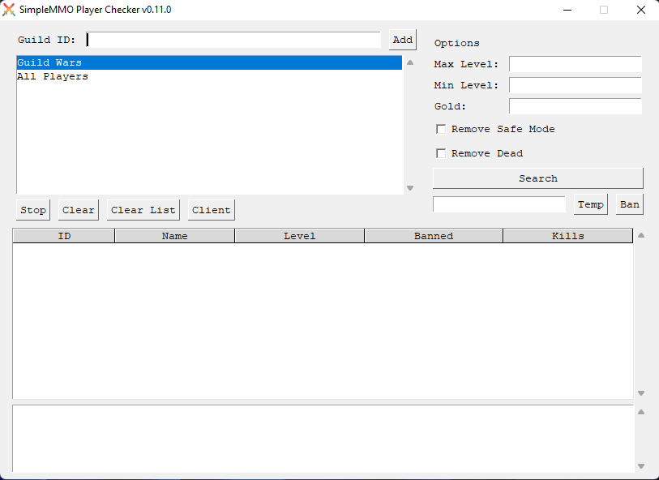

# SMMO Player Checker
## About
Standalone utility to check player status for PvP interests in SimpleMMO.
Please note due to global hotkeys, Windows might detect the program as a virus, **it is not a virus**. Feel free to view the orginial source code to confirmation.

## Initial Config
Update `config.ini` with your API key from the SMMO webapp and enter other player information.

Run by double clicking `SimpleMMO Player Checker.exe`

Sample Config:
```ini
[DEFAULT]
version_number = 0.11.0
api_key = 16sdfiAIJW.124924snviAJDFP_WIODS
web_hook = https://webhook.com/example
own_guild = 123
hotkey1 = k
hotkey2 = s
theme = light
```

### Options
API Key: https://web.simple-mmo.com/p-api/home

Keys: `a`, `b`, `c`, `alt`, `ctl`, `ctl-a`, etc.

Themes: `light` or `dark`


## Images
Main Screen


